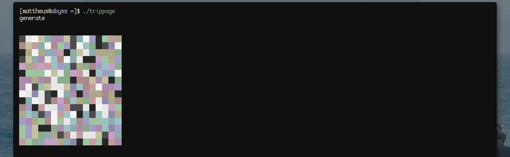
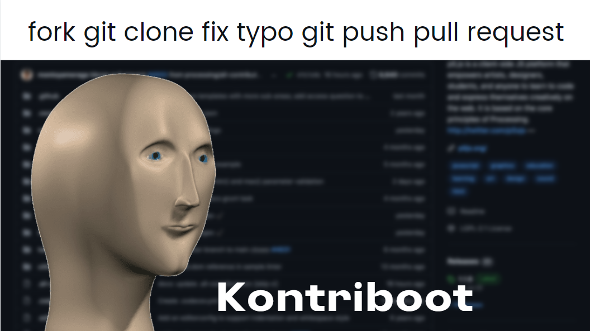

# About
*Trippage* is a CLI random image generator ran as an asynchronous interactive shell.

## Getting started
### Prerequisites
* Rust

Ideally, you'd use your package manager, but if that is not an option you can install Rust universally.

1. Install `rustup` via `curl`.
```sh
curl --proto '=https' --tlsv1.2 -sSf https://sh.rustup.rs | sh
```

2. Use `rustup` to install *Rust*.
```sh
rustup init
```

### Installation
After *Rust* has been installed, we can use `cargo` to install *Trippage* through `git`.
```
cargo install --git https://codeberg.org/mattheus/trippage
```

## Usage
* `generate` creates an image randomly.
* `seed` takes in a string of characters and generates an image using them.
* `export` saves the image as a PNG.

## Screenshots
### Example


## Contributing
Follow these steps for optimal contribution.


See  for more information.

## License
Licensed under the EUPL-1.2 or later. See `LICENSE.md` for information.
