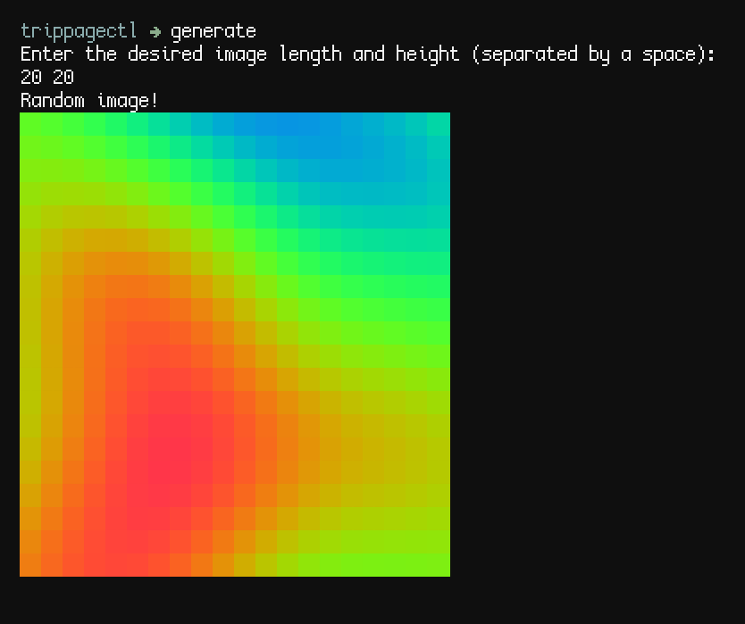

# About
Trippage is a CLI random image generator ran as an asynchronous interactive shell.

## Usage
* `generate` creates an image randomly.
* `seed` takes in a string of characters and generates an image using them.
* `export` saves the image as a PNG.

## Installation
Requires:

* [Git](https://git-scm.com/downloads)
* [Rust](https://www.rust-lang.org/tools/install)

```
git clone https://codeberg.org/mattheus/trippage && cd trippage && cargo install
```

## Screenshots
### Example

